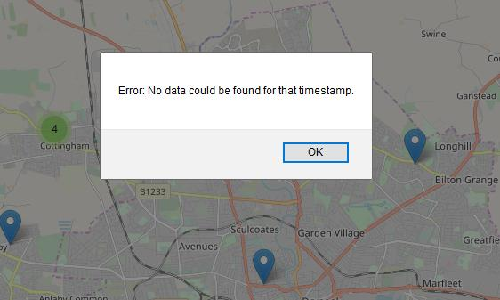
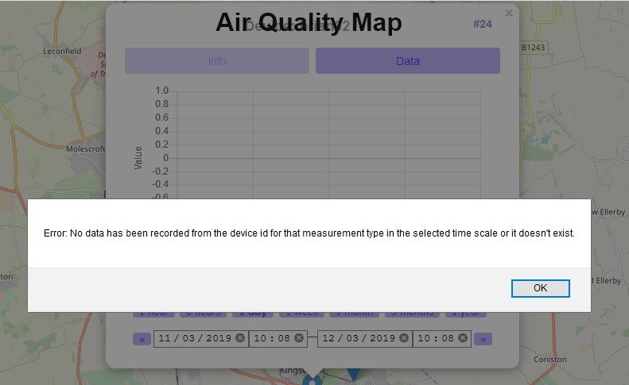
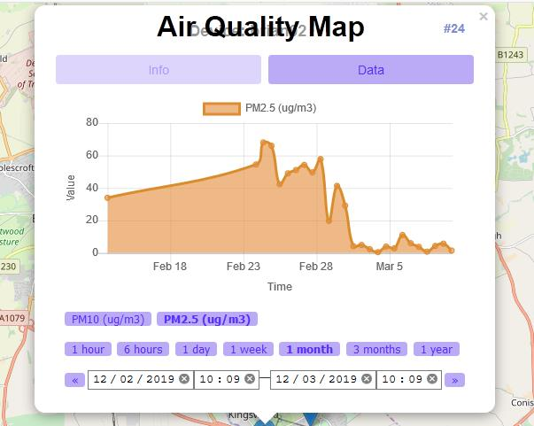

# Installing the Air Quality Map on a Raspberry Pi

These instructions will enable you to install the Connected Humber Air Quality Map API/APP on a Raspberry Pi for the purposes of testing changes.

These instructions assume you will want to use the, recommended, NGINX web server and the MariaDB (MySQL) for the 
database.

You will also install a small python program (dbLoader.py) to listen to either the Connected Humber MQTT broker or a local Mosquitto broker which you can publish test messages to.

**CAVEAT:** At this time, this system is undergoing constant change and this document may fall behind, especially the **Air Quality Web** section which is being worked on and updated frequently.

## Hardware Required

1. A Raspberry Pi 3/3+ would be great as they have on-board WiFi. Possibly this software could also be installed on any other Linux based hardware and earlier RPi (though the 3+ is faster)
2. Bluetooth Keyboard, mouse and an HDMI monitor you can find out what IP address your Pi has been given. Thereafter you could use a program called Putty to remote login to a terminal window
3. An internet connection - the faster the better

## Database
For offline testing you will need to install MariaDB (MySQL) and import a `mysqldump` of the database. So you should get a copy of the dump before you start. Note that a `mysqldump` will get bigger as time proceeds.

If you are not bothered about testing with historic data you could use a dump without data but you will need to add some entries to the `devices`, `device_types` and `reading_value_types` tables before you can start loading records from the MQTT broker.


# Installation
Assuming your Pi has a mouse, keyboard and monitor...

## RPi Stretch

1. You should begin by doing a clean install of Raspbian Stretch on an SD card.
	1. make a note of the login password you set
	2. make a note of the IP address (192.168.1.80 in my case)
2. If the mouse is slow to respond add the following to the end of the `/boot/cmdline.txt` file whilst Raspbian updates.

```
usbhid.mousepoll=0
```

## PHP 7.x

You need at least php v7.1. if `php -v` shows a lower version then you need to upgrade it as follows:-

### Step 1
`sudo nano /etc/apt/sources.list.d/10-buster.list`
  add this line:-

```
deb http://mirrordirector.raspbian.org/raspbian/ buster main contrib non-free rpi
```


### Step 2
`sudo nano /etc/apt/preferences.d/10-buster`

Add the following lines:

```
Package: *

Pin: release n=stretch

Pin-Priority: 900

Package: *

Pin: release n=buster

Pin-Priority: 750
```

### Step 3
``sudo apt update`

**NOTE: You may need to change the version number in the following command as time goes by:-**

1. `sudo apt-get install -t buster php7.3 php7.3-curl php7.3-gd php7.3-fpm php7.3-cli php7.3-opcache php7.3-mbstring php7.3-xml php7.3-zip php7.3-mysql`
2. `php -v` should show you have installed php version 7.3, or later, ok

## Web Server

### Step 1
`sudo apt install nginx`

You should now be able to use the browser and access localhost to get the Nginx welcome screen.

Configure nginx for php:

1. `cd /etc/nginx/sites-available`
2. `sudo nano default`

Uncomment the PHP section so it looks like this:

```
		# pass PHP scripts to FastCGI server
		#
		
		location ~\.php$ {
			
			include snippets/fastcgi-php.conf;
			
			# With php-fpm (or other unix sockets):
			fastcgi\_pass unix:/run/php/php7.3-fpm.sock;
			
			# With php-cgi (or other tcp sockets):
			#fastcgi\_pass 127.0.0.1:9000;
			
		}
```

We are going to put the Air Quality Web code into the localhost html folder (`/var/www/html`). If you know how to setup a virtual site using nginx then you should do so now and use the root of that server (something like `/var/www/mysite.com` or `/srv/mysite.com`, maybe)

For systems which may be accessed from the internet you need to lock down access to config info as follows:

**In Nginx:**

```
nano /etc/nginx/nginx.conf
```

Put this inside the "server {  }" block:

```
location ^~ **/path/to/data/directory** {
    deny all;
}
```


NOTE: `/path/to/data/directory` might be `/var/www/html/data` if you are not using a virtual website

**In Apache:**

Create a file called `.htaccess` inside the `data/` directory with this content

```
Require all denied
```

Finally, restart the web server

 - Nginx: `sudo systemctl restart nginx`
 - Apache: `sudo systemctl restart apache2`


## Database

You will need an SQL dump of the database ready before you do this. You could put this on a USB drive or install an ftp server/client (not covered here)

```
sudo apt install mariadb-client mariadb-server
```

The password for sudo access to mysql is the same as the pi login password from earlier.

To make life easier for now, upload the database and add a user with full access rights. This is ok on a test machine but you would secure the database against attacks on the live machine. You would fully secure a public system.

```
sudo mysql
>create database aq_db;
>use aq_db;
>source <your sqldump file>
>grant all privileges on aq_db.* to username@localhost identified by "password"
```

**username** and **password** will be your dbUser and dbPassword which you need to access the database and 
place in the settings files for dbLoader.py and the Air Quality Map.

## Update Node-Red & NPM

```
cd $HOME;
curl -OL https://gitlab.com/sbrl/bin/raw/master/node-update;
chmod +x node-update;
./node-update
```


## Air Quality Web
Finally, we are going to build the AQW software in a folder then copy the files into `/var/www/html`. You need to be logged in as a regular user (pi is fine)

```
cd $HOME
git clone https://github.com/ConnectedHumber/Air-Quality-Web
cd Air-Quality-Web
./build setup setup-dev
```

The following warning can be ignored:

```
leaflet.marckercluster1.4.1 requires a peer of leaflet@~1.3.1 but none installed
```

Now run these commands

```
NODE_ENV=production ./build client
```

Edit the file **data/settings.toml** and add the database username and password.

If your database is on a remote machine edit `settings.default.toml` find the line `host="127.0.0.1"` and set the IP to your database machine.

You will need to ensure your database server allows remote access with a suitably secure grant command.

Copy the files to the web site root:

```
sudo cp -r * /var/www/html
sudo chown -R www-data:www-data /var/www/html/*
```

Now point your browser at `localhost/app` and the Air-Quality-Map page should display.

## Adding New Devices

Currently this is a manual task.

Devices not listed in the devices table are ignored - you will see messages in the dbLoader log file which says 
something like

```
processJob(nnn): unresolved device_id. Payload skipped&#39;
```

## Keeping the local database up to date

The database is updated with a python program which subscribers to our broker and processes the messages it received.

You need to run `dbLoader.py` on your local machine. You can find it here:-

<https://github.com/ConnectedHumber/MQTT/tree/master/Subscriber>

You need BOTH `dbLoader.py` and `settings.py`.

Edit `settings.py` and put in the correct username/password for the Connected Humber MQTT broker and your local database.

## Logfile rotation
Create a file in `/etc/logrotate.d`:

```
sudo nano /etc/logrotate.d/dbLoader
```

Add the following (if you changed the `logFile` name in `settings.py` change it here too).

```
/var/log/aq_db.log {
	missingok
	notifyempty
	size 50k
	daily
	compress
	maxage 30
	rotate 10
	create 0644 root root
	copytruncate
}
```

## Adding dbLoader as a service
This will allow you to control the `dbLoader`

```
sudo nano /etc/system.d/system/dbloader.service
```

Add these lines:

```
[Unit]
Description=dbLoader service
After=mysqld.service
StartLimitIntervalSec=0

[Service]
Type=simple
Restart=always
RestartSec=1
User=root
ExecStart=/usr/bin/env python /home/pi/aq_db/dbLoader.py

[Install]
WantedBy=multi-user.target
```

Now you can control `dbLoader` with commands like:
```
sudo systemctl start dbLoader
sudo systemctl status dbLoader
sudo systemctl stop dbLoader
```

In order to have `dbLoader` restart on boot use this command:

```
sudo systemctl enable dbLoader
```

Note that you will be prompted for the User's password.


## Database Schema Changes

Currently it is a manual task to add extra columns/tables. If there are any changes it is simpler to request a new SQL dump of the existing database, drop the existing `aq_db` tables (not the database) then import the SQL dump with the source command as was done earlier.

## Local MQTT broker (optional)

You can install [Mosquitto](https://mosquitto.org/) as a local MQTT broker then publish test messages to it. If you configure dbLoader.py to listen to your test broker it will then add you data to your local database.

```
sudo apt-get update
sudo apt-get install mosquito
```

The mosquito service will run automatically.

You can add password/username to the broker (if you need to). The instructions here will help you do that.

<http://www.steves-internet-guide.com/mqtt-username-password-example/>


## Finally
When you fire up the map you will, inevitably, get this message:



It simply means the database needs fresh data.

When you click on a blue marker you may get this:



When the dialog displays it chooses a recent timescale. The messages just means the device hasn't got any recent data (it could be offline). Select a different time frame and you should get something like this:


